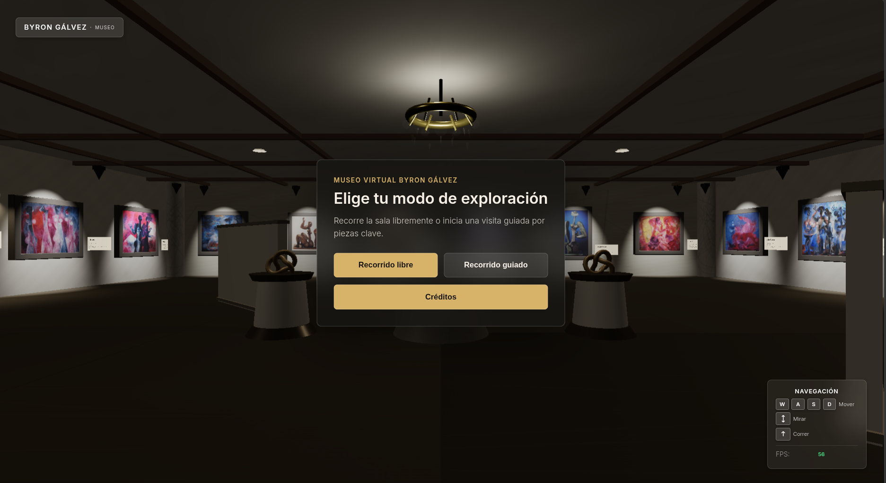

# Byron Gálvez Virtual Museum

Byron Gálvez Virtual Museum es una experiencia de museografía digital y arte tecnológico dedicada al universo pictórico de Byron Gálvez. El proyecto utiliza código, espacio WebGL, luz, audio, movimiento, proximidad e interfaz como recursos de mediación, no solo como infraestructura técnica.

La experiencia conserva la forma de una galería 3D navegable, pero su propósito es interpretativo: explorar el color como fuerza emocional, la textura como materia pictórica, la geometría como tensión, el cuerpo como presencia simbólica y la luz como una forma de revelar lo invisible.



## Demo

URL de despliegue: [Ver proyecto](https://deepdevjose.github.io/Byron-s-virtual-museum/)

## Visión Artística Y Curatorial

Este museo no es únicamente un contenedor de imágenes. Es una experiencia de museografía digital donde la tecnología participa en la construcción de sentido:

- La abstracción y la figuración se entienden como un campo continuo, no como categorías separadas.
- El color se presenta como estructura, atmósfera y presión emocional.
- La textura, el volumen y la profundidad se enfatizan mediante lectura cercana y tratamiento material.
- La luz revela relaciones entre cuerpo, ritual, sombra y memoria.
- La figura femenina aparece como sensualidad, ternura, misterio, ceremonia y presencia simbólica.
- La experiencia articula la tensión entre lo apolíneo y lo dionisiaco: geometría, ritmo, sensualidad y fuerza cromática.
- La lectura reconoce resonancias con raíces populares mexicanas, tradiciones prehispánicas, Rufino Tamayo, el expresionismo, el cubismo, Picasso, Wilfredo Lam, el arte africano y la pintura mexicana moderna.
- Byron Gálvez se presenta como pintor, escultor y grabador; por eso la galería digital atiende imagen, materia, cuerpo y volumen.

Consulta [`docs/curatorial-vision.md`](docs/curatorial-vision.md) para conocer la estructura curatorial completa.

## Características De La Experiencia

- Exploración libre en primera persona con teclado, mouse y pointer lock.
- Controles móviles con joystick, área de mirada y botón de acción.
- Galería 3D procedimental con piso, muros, techo, tragaluz, mobiliario e iluminación.
- Salas temáticas: entrada sagrada, abstracción/figuración, color/textura/profundidad, mujeres/ritual/sensualidad, luz/invisible, paisaje/espacio interior y tecnología como recurso curatorial.
- Catálogo de obra en `src/data/artworks.json` con lecturas formales, simbólicas, emocionales y de interacción.
- Obras enmarcadas con texturas de imagen y fichas generadas dentro de la escena.
- Raycasting al centro de pantalla para selección, proximidad y frases de mediación.
- Panel lateral y modal de obra en pantalla completa con lectura por secciones.
- Modo para explorar superficie y textura con acercamiento sobre la imagen.
- Recorrido guiado por salas temáticas y conceptos artísticos.
- Textos de sala con aparición y salida suave.
- Respuesta sutil de foco y audio ambiental al aproximarse a las obras.
- Modal de créditos y secuencia de cierre del recorrido guiado.
- Contador FPS y scripts de validación.

## Tecnologías

La solución técnica se mantiene ligera para que la obra, la luz y el encuentro espacial sean el centro de la experiencia:

- Three.js r128
- WebGL
- JavaScript con ES modules
- HTML
- CSS
- JSON para datos de obra
- Cloudinary para entrega externa de videos
- Node.js para scripts de validación

Consulta [`docs/tables/technologies.md`](docs/tables/technologies.md) para ver la tabla técnica completa.

## Instalación

Este es un proyecto web estático. No requiere `package.json` ni instalación con npm.

Clona el repositorio y levanta un servidor HTTP local desde la raíz:

```bash
python3 -m http.server 8000
```

Abre:

```text
http://localhost:8000
```

Se recomienda usar servidor HTTP porque la aplicación carga `src/data/artworks.json`.

## Comandos De Desarrollo

```bash
python3 -m http.server 8000
```

## Build

No hay proceso de build configurado. El proyecto está diseñado para ejecutarse como archivos estáticos.

## Validación

```bash
node scripts/smoke-test.js
node scripts/validate-artworks.js
```

También hay scripts de benchmark y verificación en `scripts/` para uso desde consola del navegador.

## Estructura Del Proyecto

```text
Byron-s-virtual-museum/
├── index.html
├── README.md
├── docs/
├── scripts/
│   ├── benchmark-lod.js
│   ├── benchmark-occlusion.js
│   ├── benchmark-shadows.js
│   ├── smoke-test.js
│   ├── validate-artworks.js
│   └── verify-frustum-culling.js
└── src/
    ├── assets/
    │   ├── audio/
    │   ├── credits/
    │   └── images/
    ├── css/
    │   └── style.css
    ├── data/
    │   └── artworks.json
    └── js/
        ├── config.js
        ├── main.js
        └── modules/
            ├── Core/
            ├── Curatorial/
            ├── Interaction/
            ├── Player/
            ├── Tour/
            ├── UI/
            ├── Utils/
            └── World/
```

## Índice De Documentación

- [`docs/curatorial-vision.md`](docs/curatorial-vision.md)
- [`docs/00-article-plan.md`](docs/00-article-plan.md)
- [`docs/01-project-overview.md`](docs/01-project-overview.md)
- [`docs/02-problem-statement.md`](docs/02-problem-statement.md)
- [`docs/03-objectives.md`](docs/03-objectives.md)
- [`docs/04-system-architecture.md`](docs/04-system-architecture.md)
- [`docs/05-methodology.md`](docs/05-methodology.md)
- [`docs/06-implementation.md`](docs/06-implementation.md)
- [`docs/07-gallery-and-artwork-model.md`](docs/07-gallery-and-artwork-model.md)
- [`docs/08-cloudinary-video-integration.md`](docs/08-cloudinary-video-integration.md)
- [`docs/09-ui-ux-design.md`](docs/09-ui-ux-design.md)
- [`docs/10-guided-tour.md`](docs/10-guided-tour.md)
- [`docs/11-performance-optimization.md`](docs/11-performance-optimization.md)
- [`docs/12-testing-and-validation.md`](docs/12-testing-and-validation.md)
- [`docs/13-results.md`](docs/13-results.md)
- [`docs/14-discussion.md`](docs/14-discussion.md)
- [`docs/15-limitations.md`](docs/15-limitations.md)
- [`docs/16-future-work.md`](docs/16-future-work.md)
- [`docs/17-maintenance-guide.md`](docs/17-maintenance-guide.md)
- [`docs/code-documentation.md`](docs/code-documentation.md)

## Videos En Cloudinary

Los videos animados de las obras se entregan desde Cloudinary para no almacenar archivos pesados en el repositorio. Los registros de obra incluyen URLs de entrega en `src/data/artworks.json`, y el modal crea el elemento de video solo cuando el visitante abre una obra.

Como mejora futura se recomienda estandarizar transformaciones de Cloudinary como:

```text
q_auto,f_auto,w_1280
```

## Estado Del Proyecto

Implementado:

- Galería 3D.
- Controles de exploración libre.
- Carga de catálogo de obra.
- Interacción con obras y modal de detalle.
- Modal de créditos.
- Recorrido guiado.
- Soporte para videos externos en Cloudinary.
- Lectura de textura y ampliación de imagen.
- Textos de sala y mediación por proximidad.
- Documentación curatorial y técnica.

Pendiente:

- Mediciones formales de rendimiento.
- Optimización integral de URLs de Cloudinary.
- Subtítulos y transcripciones para medios.
- Revisión amplia de accesibilidad.
- Matriz de pruebas en navegadores y dispositivos móviles.

## Créditos

- Desarrollo: José Manuel Cortés Cerón
- Obra artística: Byron Gálvez
- Tecnologías: Three.js, WebGL, JavaScript, HTML, CSS, Cloudinary

## Derechos Y Uso

Las obras visuales presentadas pertenecen a sus autores o titulares de derechos. Este museo virtual tiene fines educativos, culturales y de difusión.

## Licencia

El repositorio no incluye un archivo de licencia abierta. Hasta que se agregue una licencia, la reutilización, redistribución y explotación comercial deben considerarse restringidas.
