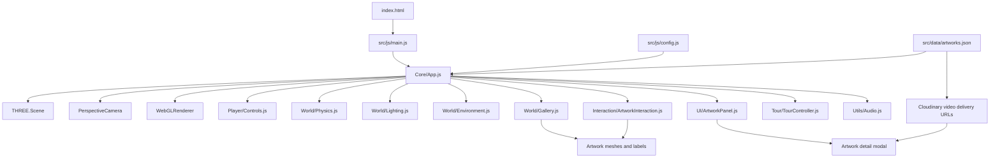

# System Architecture

## Overview

The project is a static browser application. `index.html` provides the DOM scaffolding, import map, CSS link, ambient audio element, modal containers, and the module entry script. `src/js/main.js` waits for `DOMContentLoaded`, creates `App`, exposes it as `window.app` for diagnostics, and calls `app.init()`.

## Main Entry Points

- `index.html`: Static HTML entry point and Three.js import map.
- `src/js/main.js`: JavaScript entry point.
- `src/js/modules/Core/App.js`: Main lifecycle coordinator.
- `src/js/config.js`: Shared runtime configuration.
- `src/data/artworks.json`: Artwork metadata catalog.

## Core Application Lifecycle

`App.init()` performs the main startup sequence:

1. Shows the loader.
2. Fetches `src/data/artworks.json`.
3. Preloads artwork images with a timeout fallback.
4. Creates the Three.js scene, camera, and renderer.
5. Instantiates controls, physics, lighting, environment, gallery, UI, interaction, tour, and audio modules.
6. Registers resize and credits modal events.
7. Hides the loader.
8. Shows the welcome overlay.
9. Starts the animation loop.

## Scene, Renderer, And Camera

Scene setup lives in `src/js/modules/Core/App.js`.

- Scene: `THREE.Scene` with exponential fog.
- Camera: `THREE.PerspectiveCamera` using values from `CONFIG.camera`.
- Renderer: `THREE.WebGLRenderer` with high-performance preference, sRGB encoding, ACES filmic tone mapping, and manual shadow-map updates.
- Canvas host: `#canvas-container` in `index.html`.

## World Modules

- `src/js/modules/World/Environment.js`: Builds floor, walls, ceiling, skylight, chandelier, beams, pillars, baseboards, and procedural textures.
- `src/js/modules/World/Gallery.js`: Builds artwork groups, frames, image planes, canvas-textured labels, decorative objects, and collision metadata.
- `src/js/modules/World/Lighting.js`: Adds ambient light, directional skylight, fill lights, artwork spotlights, and wall sconces.
- `src/js/modules/World/Physics.js`: Applies simple X/Z-plane room bounds and object collision response.

## Interaction And UI Modules

- `src/js/modules/Player/Controls.js`: Handles keyboard movement, pointer-lock look, drag-look fallback, and shared movement state for mobile controls.
- `src/js/modules/Interaction/ArtworkInteraction.js`: Uses `THREE.Raycaster` for hover and click selection.
- `src/js/modules/UI/ArtworkPanel.js`: Creates the side panel and artwork detail modal media markup.
- `src/js/modules/Utils/Audio.js`: Starts and pauses ambient audio after user interaction.

## Guided Tour System

- `src/js/modules/Tour/tourPath.js`: Generates tour stops from wall-mounted artwork positions.
- `src/js/modules/Tour/TourController.js`: Interpolates camera position and quaternion, updates tour HUD text, focuses artwork, and advances after detail modal closure.

The guided tour is implemented and connected from the welcome overlay. It remains a candidate for future refinement around pacing, captions, and curatorial narrative.

## External Video Integration

Artwork records include Cloudinary video delivery URLs in the `video` field. `ArtworkPanel` creates a video element only when the detail modal opens. Optimized Cloudinary transformations and stronger cleanup behavior are recommended but not fully implemented in the current source.

## Architecture Diagram

Diagram source: [`diagrams/architecture.mmd`](diagrams/architecture.mmd).

