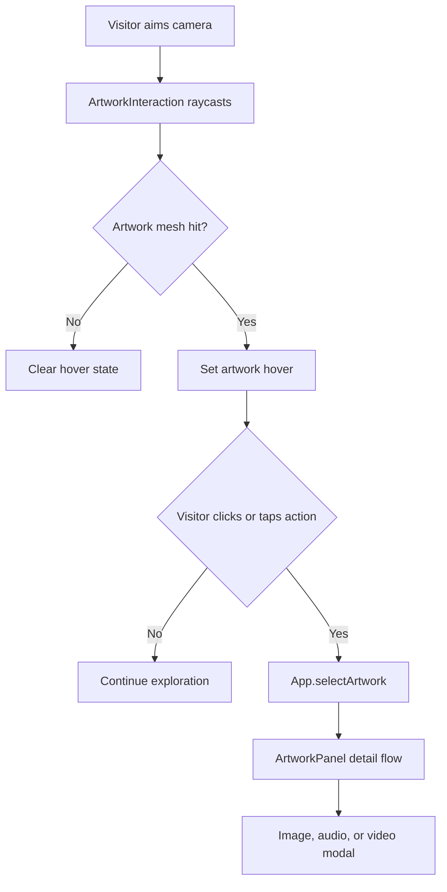

# Gallery And Artwork Model

## Current Artwork Representation

Artwork data is stored in `src/data/artworks.json` as an array of records. `App.loadArtworks()` fetches this file during startup. The data is used by:

- `Gallery` to create framed artwork groups.
- `Lighting` to aim artwork spotlights.
- `TourController` and `tourPath.js` to generate guided tour stops.
- `ArtworkPanel` to populate detail modals.

## Mesh And Texture Creation

`Gallery.createRealisticArtwork()` creates a `THREE.Group` for each artwork. The group is placed using the record's `position` and optional `rotation`.

The artwork is first built with fallback material. If an `image` URL exists, `THREE.TextureLoader` loads it, the final size is fitted to the source aspect ratio, and the group is rebuilt with the loaded texture. The artwork plane stores metadata in `mesh.userData` and becomes the raycast target.

## Frames And Labels

`Gallery.createFrame()` creates an extruded frame and backing board. Featured artworks use a slightly larger frame width. `Gallery.createArtworkLabel()` renders text onto a canvas and converts it into a `THREE.CanvasTexture`, producing an in-scene plaque beside the artwork.

## Interaction

`ArtworkInteraction` raycasts against artwork meshes. During pointer-lock navigation, the ray starts at the center of the screen. On hover, `Gallery.setArtworkHoverState()` changes frame material properties and updates the crosshair state. On click, `App.selectArtwork()` routes the selection to the appropriate UI surface.

Diagram source: [`diagrams/artwork-interaction-flow.mmd`](diagrams/artwork-interaction-flow.mmd).



## Recommended Data Model

The current model is mostly data-driven. Future additions should keep records complete and stable. If new fields are added, `scripts/validate-artworks.js` should be updated accordingly.

## Example Artwork Record

```json
{
  "id": "velitas",
  "title": "Velitas",
  "artist": "Byron Galvez",
  "year": "2024",
  "technique": "Tecnica mixta",
  "description": "Short curatorial description shown in labels and modals.",
  "image": "./src/assets/images/Velitas - Byron.jpg",
  "poster": "./src/assets/images/Velitas - Byron.jpg",
  "video": "https://res.cloudinary.com/dk6fga5vq/video/upload/v1777926881/Velitas_-_Byron_s1ue7p.mp4",
  "position": [0, 2.2, 13.7],
  "rotation": [0, 3.1415926536, 0],
  "size": [2.2, 1.8],
  "featured": false,
  "viewDistance": 5.15,
  "cameraHeight": 1.7
}
```

## Field Notes

- `id`: Unique stable identifier.
- `title`: Display title.
- `artist`: Artist name.
- `year`: Display year.
- `technique`: Technique string used in labels and modals.
- `description`: Description shown in UI and generated labels.
- `image`: Local image path used for gallery texture and poster fallback.
- `poster`: Recommended future field for a distinct video poster. The current code uses `image`.
- `video`: Optional remote delivery URL, currently Cloudinary for most records.
- `audio`: Optional audio guide URL. If present, the current modal logic prioritizes audio over video.
- `position`: Three.js `[x, y, z]` scene coordinates.
- `rotation`: Optional Euler rotation in radians.
- `size`: Maximum `[width, height]` before aspect-ratio fitting.
- `featured`: Optional larger frame styling.
- `viewDistance`: Optional guided-tour camera distance override.
- `cameraHeight`: Optional guided-tour camera height override.
