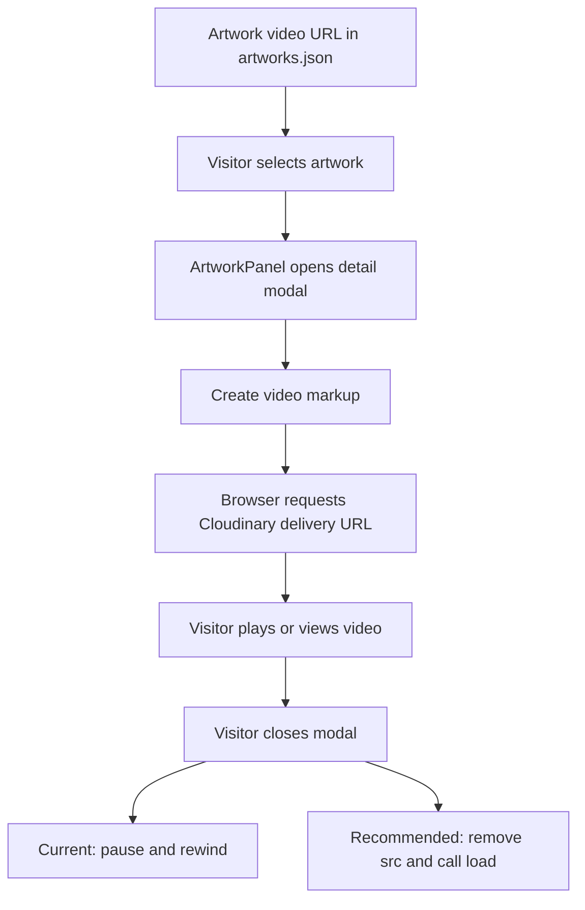

# Cloudinary Video Integration

## Why Videos Should Stay Outside Git

Animated artwork videos can be large and can quickly inflate Git history. Keeping them outside the repository makes cloning, reviewing, and deploying the project easier. The repository should store source code, metadata, images, and lightweight audio assets, while large videos are delivered from an external media service.

## Why Cloudinary

Cloudinary provides hosted media delivery, transformation URLs, and CDN-backed distribution. In this project, artwork records already contain Cloudinary video delivery URLs in `src/data/artworks.json`.

## Current Implementation Status

Cloudinary integration is partially implemented:

- Implemented: Artwork records include Cloudinary video delivery URLs.
- Implemented: `ArtworkPanel.createVideoMarkup()` can create a video element using an artwork's `video` URL.
- Implemented: Video markup is created only when the detail modal opens.
- Pending hardening: URL transformation standardization with `q_auto,f_auto,w_1280`.
- Pending hardening: On modal close, remove media `src` values and call `load()` after pausing. The current code pauses and rewinds media but does not remove the source.

## Collection URL Versus Delivery URL

A Cloudinary collection or management URL is used to browse or manage assets. It is not the URL that should be placed in an HTML video element.

A Cloudinary delivery URL points directly to an optimized asset representation and can be used in a `<source src="...">` element.

## Recommended Transformation Pattern

Use Cloudinary transformations to reduce bandwidth and let Cloudinary choose efficient quality and format where supported:

```text
q_auto,f_auto,w_1280
```

Original delivery URL:

```text
https://res.cloudinary.com/dk6fga5vq/video/upload/v1777926881/Velitas_-_Byron_s1ue7p.mp4
```

Optimized delivery URL:

```text
https://res.cloudinary.com/dk6fga5vq/video/upload/q_auto,f_auto,w_1280/v1777926881/Velitas_-_Byron_s1ue7p.mp4
```

## Lazy Loading Strategy

Videos should not be loaded during initial scene startup. The recommended pattern is:

1. Store the delivery URL in artwork metadata.
2. Open the artwork detail modal.
3. Create or assign the video source at that moment.
4. Use `preload="metadata"` unless full preloading is intentionally needed.

The current implementation follows the main lazy-loading idea by injecting video markup only when the modal opens.

## Cleanup Strategy

When closing the modal, recommended cleanup is:

1. Pause the video.
2. Reset playback time.
3. Remove the `src` attribute from `<source>` or `<video>`.
4. Call `video.load()` so the browser releases the media resource.

The current implementation pauses and rewinds media. Removing `src` and calling `load()` is documented as future hardening.

## Flow Diagram

Diagram source: [`diagrams/cloudinary-video-flow.mmd`](diagrams/cloudinary-video-flow.mmd).


