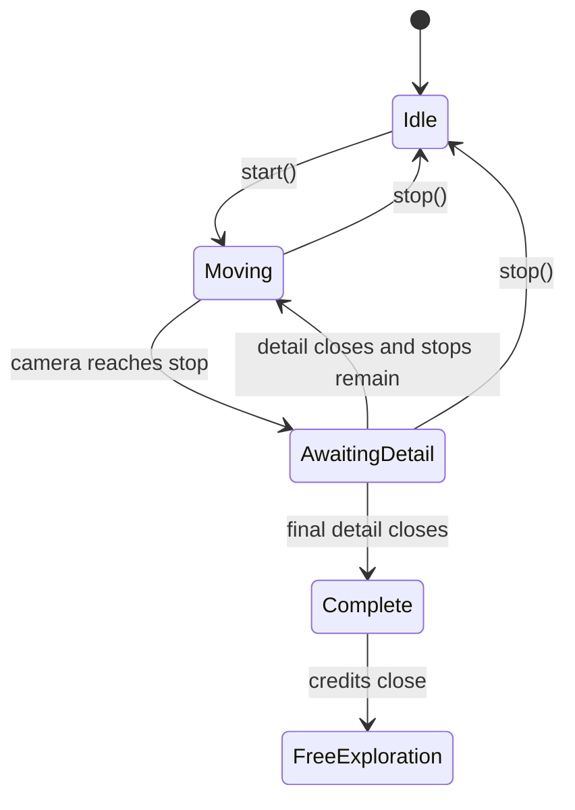

# Guided Tour

## Purpose

Guided tour mode provides a structured viewing path through the gallery. It helps visitors experience the museum without needing to manually locate each artwork.

## Current Status

Guided tour mode is implemented. It is functional, but future curatorial improvements are still possible, including richer stop narration, captions, audio narration, and manually curated pacing.

## How It Works

- `App.startGuidedTour()` hides open artwork UI, resets movement, disables manual movement, disables pointer lock, disables artwork interaction, and starts `TourController`.
- `createTourPathFromArtworks()` generates stops from wall-mounted artworks in `src/data/artworks.json`.
- `TourController.prepareMoveToCurrentStop()` stores the current camera position and quaternion, computes the next target position, and updates the HUD.
- `TourController.update()` interpolates camera position and orientation.
- After movement completes, `TourController.focusCurrentArtwork()` asks App to show the artwork panel in tour context.
- When the detail modal closes, `App.onArtworkDetailClosed()` advances the tour.
- After the final stop, `App.onTourCompleted()` shows a completion modal, opens credits, and then returns to free exploration.

## Camera Path Logic

The path is generated from artwork positions and wall orientation. For each artwork, `tourPath.js` computes a camera position offset from the artwork along its wall normal. The camera looks at the artwork position.

## User Control Behavior

Manual movement is disabled during the guided tour. Pointer lock is also disabled so the camera can be controlled by the tour interpolation. The visitor can exit the tour through the tour HUD button.

## Flow Diagram

Diagram source: [`diagrams/guided-tour-flow.mmd`](diagrams/guided-tour-flow.mmd).

## Future Improvements

- Add curated text per stop instead of generated title-only HUD text.
- Add audio narration.
- Add pause, resume, previous, and next controls.
- Add progress indicators.
- Add captions or transcripts for media shown during tour stops.
- Allow manually curated camera positions for difficult wall layouts.
